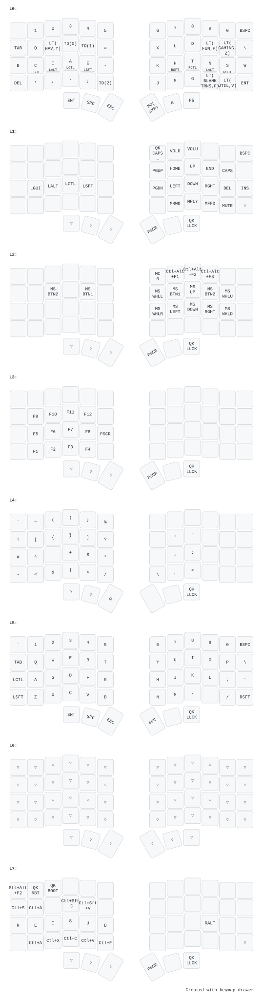

# Silakka54

Silakka54 is a RP2040 Zero based 54-key column staggered split keyboard. PCB uses hotswap sockets. Design is inspired from REVIUNG41 and Corne keyboards.

PCB is designed for MX style key switches. Current top plate only supports MX style switches. 5-pin switches are supported. I recommend using Vial firmware.

**For more information visit https://github.com/Squalius-cephalus/silakka54/wiki**

<!--  -->

<!-- PCB design uses footprints from [ScottoKeebs](https://github.com/joe-scotto/scottokeebs/tree/main/Extras/ScottoKicad "ScottoKeebs") and [kbd library.](https://github.com/foostan/kbd "kbd library.") -->

# My keymap



# Symlinks

```shell
 cd firmware/keymaps
 ls -l vial_*/rules.mk
Permissions Size User   Group  Date Modified Name
lrwxrwxrwx     - bassam bassam  3 Sep 14:59   vial_enthium_led_caps/rules.mk -> ../vial_enthium_led/rules.mk
.rw-r--r--   267 bassam bassam  3 Sep 15:01   vial_enthium_led_keypeek/rules.mk
.rw-r--r--   249 bassam bassam  3 Sep 14:10   vial_enthium_led/rules.mk
.rw-r--r--   203 bassam bassam  7 Aug 18:32   vial_enthium/rules.mk
lrwxrwxrwx     - bassam bassam  3 Sep 14:59   vial_led_caps/rules.mk -> ../vial_enthium_led/rules.mk
lrwxrwxrwx     - bassam bassam  3 Sep 14:59   vial_led_oneside/rules.mk -> ../vial_enthium_led/rules.mk
.rw-r--r--   127 bassam bassam 20 May 22:13   vial_led/rules.mk

 ls -l vial_*/config.h
Permissions Size User   Group  Date Modified Name
.rw-r--r--   285 bassam bassam  7 Aug 18:32   vial_enthium/config.h
lrwxrwxrwx     - bassam bassam  3 Sep 15:37   vial_enthium_led_caps/config.h -> ../vial_enthium_led/config.h
.rw-r--r--   438 bassam bassam  3 Sep 01:27   vial_enthium_led/config.h
lrwxrwxrwx     - bassam bassam  3 Sep 15:37   vial_enthium_led_keypeek/config.h -> ../vial_enthium_led/config.h
lrwxrwxrwx     - bassam bassam  3 Sep 15:37   vial_led_caps/config.h -> ../vial_enthium_led/config.h
.rw-r--r--   407 bassam bassam 20 May 22:13   vial_led/config.h
.rw-r--r--   410 bassam bassam  7 Aug 18:32   vial_led_oneside/config.h
```
